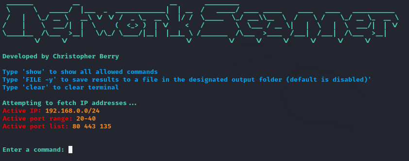

# ARP-Port-Scanner
ARP-Port-Scanner is a tool used to scan open ports and active devices on a network using an IP address or IP range it also provides an interactive shell for use.

Prefereby use on a Kali Linux Distro

[Documentation](https://www.kali.org/docs/)

## Installation 💿

1. Download this repo:

    `git clone https://github.com/Chrisdafur3/ARP-Port-Scanner.git`
    
2. Navigate to the directory:

    `cd ARP-Port-Scanner`
    
    
3. Run `pip install -r requirements.txt` or `pip3 -r requirements.txt`

## RUN 🚀

1. Run `python main.py <ip address or range>` on Windows / `sudo python3 main.py <ip address or range>` on Linux
2. Optional arguments are `-pr -pl -portscan -arpscan`
3. IP ranges are used for arpscans in the format `xxx.xxx.xxx.0/24`
4. IP addresses are used for portscans in the format `xxx.xxx.xxx.xxx`
5. Portscans can also have the `-pl` `-pr` arguments followed by the desired ports eg. `python main.py <ip address> -pl 443,90,23 -pr 100-140`
6. The `-portscan` `-arpscan` arguments can be used to automatically run the scripts from the command-line eg. 
   `python main.py <ip address> -pl 443,90,23 -pr 100-140 -portscan` or `python main.py <ip range> -arpscan`
7. `-f` `--file` is used to save results to a file eg. `python main.py <ip address> -pl 443,90,23 -pr 100-140 -portscan -f` or `python main.py <ip address> -pl 443,90,23 -pr 100-140 -portscan --file`
## Additional Information 📝
This is a tool I created to help myself grasp a better understanding of the Scapy tool as well as object oriented programming. This Tool has a fun interactive shell that provides the ability to scan a list of ports and a range of ports at the same time it also provides the ability to scan for active IP addresses in an IP range.
You have the ability to change the ports as well as the IP address while using the tool. This Tool uses a TCP stealth scan to scan for open and closed ports on a device to avoid port scanning detection by firewalls and also provides an option to save the results of open ports or active IP addresses to a .txt file.
## Repos used 📝
[Scapy](https://github.com/secdev/scapy)

[Osintgram](https://github.com/Datalux/Osintgram) - For the general shell design
